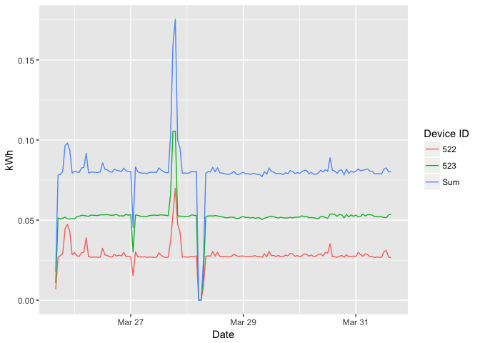
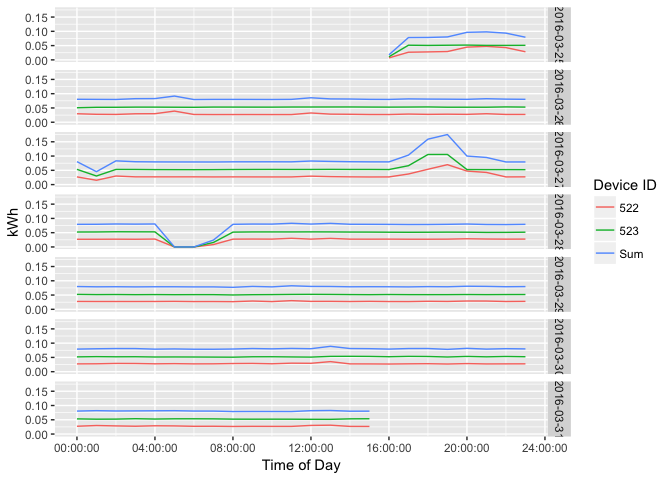
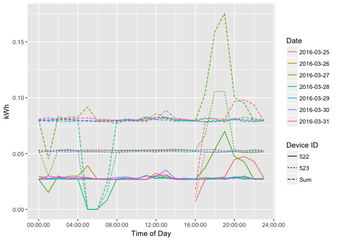
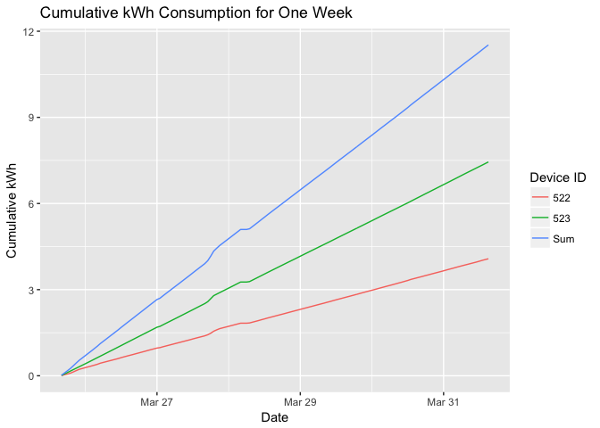
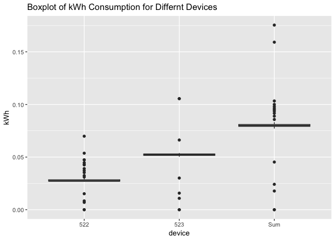
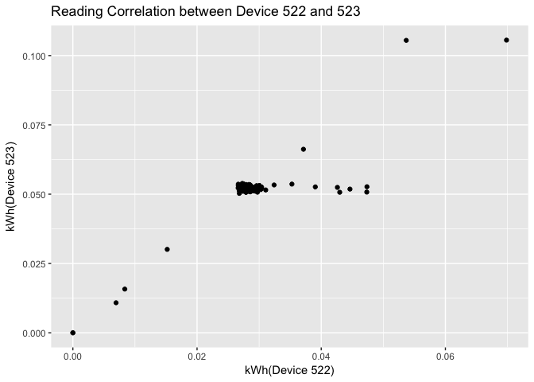
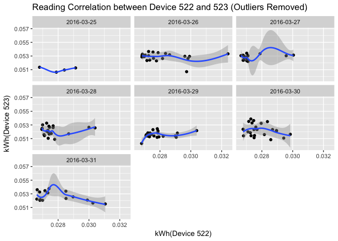

Keewi Code Test
================
Tim (Wenjie) Hu

``` r
library(tidyverse)
library(googlesheets)
library(knitr)
library(stringr)
library(lubridate)
library(hms)
```

``` r
# I tried to read data directly from google sheet, but there is a bug I couldn't fix immediately. Then I saved the data as csv on my local directory. 

# # Parameters
#   # Spreadsheet key for notes
# notes_key <- "1jiOJhqsUmHAwsgnqNSHn4m85yQL2vxhmkoZHAw2QBwQ"
# 
# # Give googlesheets permission to access spreadsheets
# gs_auth()
# 
# ## Read in notes
# notes <- 
#   gs_key(notes_key) %>%
#   gs_read(ws = "Sheet1")
```

``` r
data_file <- "/Users/timhu/Dropbox/Stanford/career/Internship/Coding Test Data - Sheet1.csv"

# read the data and remove blank columns
df_raw <- 
  read_csv(data_file, skip = 1) %>% 
  select(-c(X1, X14))

# get dataframe for device 522, 523 separately, and calculate the their sum in a new dataframe.
df_522 <- 
  df_raw %>% 
  select(`Device ID`:`Cumul kWh`)
df_523 <-
  df_raw %>% 
  select(`Device ID_1`:`Cumul kWh_1`) %>% 
  set_names(colnames(df_522))
df_sum <- 
  df_522 %>% 
  mutate(`Device ID` = "Sum",
         kWh = df_522$kWh + df_523$kWh,
         Power = df_522$Power + df_523$Power,
         `Cumul kWh` = df_522$`Cumul kWh` + df_523$`Cumul kWh`)

# concatenate above dataframes together, and get variables for the date, and time of day.
df_plot <- 
  rbind(df_522, df_523, df_sum) %>% 
  select(device = `Device ID`, cum_kWh = `Cumul kWh`, everything(), -`Excel Date`) %>% 
  mutate(date = date(time_stamp),
         daytime = as.hms(time_stamp))
```

``` r
df_plot %>% 
  ggplot(aes(time_stamp, kWh, color = factor(device))) +
  geom_line() +
  labs(x = "Date", color = "Device ID")
```



``` r
df_plot %>% 
  ggplot(aes(daytime, kWh, color =factor(device))) +
  geom_line() +
  facet_grid(date ~ .) +
  labs(x = "Time of Day", color = "Device ID")
```



``` r
  # coord_fixed(ratio=0.2)
```

``` r
df_plot %>% 
  ggplot(aes(daytime, kWh, color = factor(date), linetype = factor(device))) +
  geom_line() +
  labs(linetype = "Device ID", color = "Date", x = "Time of Day")
```



``` r
df_plot %>% 
  ggplot(aes(time_stamp, cum_kWh, color = factor(device))) +
  geom_line() +
  labs(x = "Date", color = "Device ID", y = "Cumulative kWh", title = "Cumulative kWh Consumption for One Week")
```



``` r
df_plot %>% 
  ggplot(aes(device, kWh)) +
  geom_boxplot() +
  labs(title = "Boxplot of kWh Consumption for Differnt Devices")
```



``` r
df_raw %>% 
  ggplot(aes(kWh, kWh_1)) +
  geom_point() +
  labs(x = "kWh(Device 522)", y = "kWh(Device 523)", 
       title = "Reading Correlation between Device 522 and 523")
```



``` r
df_raw %>% 
  filter(kWh_1 > 0.04, kWh_1 < 0.06, kWh < 0.035) %>% 
  ggplot(aes(kWh, kWh_1)) +
  geom_point() +
  geom_smooth() +
  facet_wrap(~date(time_stamp)) +
  labs(x = "kWh(Device 522)", y = "kWh(Device 523)", 
       title = "Reading Correlation between Device 522 and 523 (Outliers Removed)")
```



``` r
model <- lm(kWh ~ kWh_1, data = df_raw)
summary(model)
```

    ## 
    ## Call:
    ## lm(formula = kWh ~ kWh_1, data = df_raw)
    ## 
    ## Residuals:
    ##        Min         1Q     Median         3Q        Max 
    ## -0.0052359 -0.0017784 -0.0009999  0.0003859  0.0195883 
    ## 
    ## Coefficients:
    ##              Estimate Std. Error t value Pr(>|t|)    
    ## (Intercept) -0.001164   0.001616   -0.72    0.473    
    ## kWh_1        0.569692   0.030656   18.58   <2e-16 ***
    ## ---
    ## Signif. codes:  0 '***' 0.001 '**' 0.01 '*' 0.05 '.' 0.1 ' ' 1
    ## 
    ## Residual standard error: 0.003745 on 142 degrees of freedom
    ## Multiple R-squared:  0.7086, Adjusted R-squared:  0.7066 
    ## F-statistic: 345.3 on 1 and 142 DF,  p-value: < 2.2e-16
